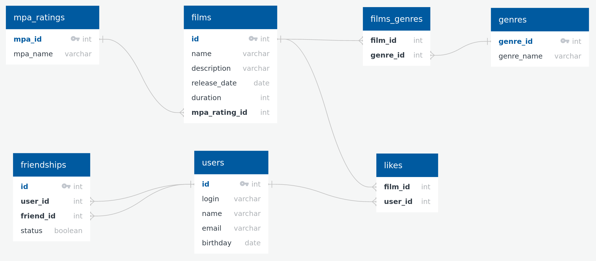

# Filmorate project


## ER-модель




## Примеры SQL запросов

#### Вывод списка всех фильмов
```
SELECT * 
FROM films;
```

#### Вывод списка всех пользователей
```
SELECT * 
FROM users;
```

#### Вывод списка названий фильмов жанра "Боевик"
```
SELECT f.name 
FROM films AS f
JOIN films_genres AS fg ON f.id = fg.film_id
JOIN genres AS g ON fg.genre_id = g.id
WHERE g.name = 'Боевик';
```
                  
#### Обновить дату релиза фильма id = 12
```              
UPDATE films 
SET release_date = '1996-06-03' 
WHERE id = 12;
```

#### Вывод списка ТОП-5 фильмов по мнению пользователей
```
SELECT f.*
FROM films AS f
JOIN likes AS l ON f.id = likes.film_id
GROUP BY f.id
ORDER BY COUNT(l.user_id) DESC
LIMIT 5;
```
